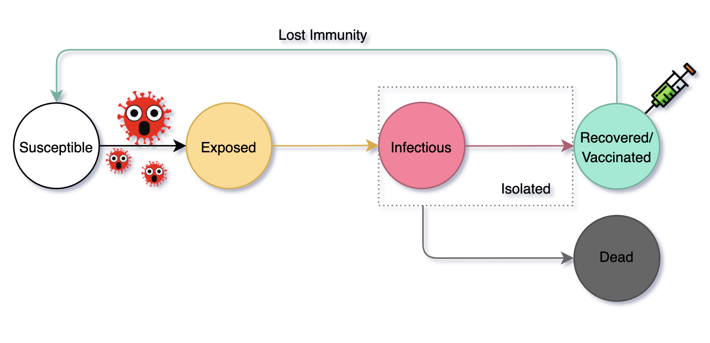

# COVID-19 outbreak modelling and simulation with respect to the longevity of antibody and vaccination strategy

## About the project 

This project is designed to simulate virtual virus spreading scenarios to address concerns about COVID-19 in early 2020.

 

## Background
 Researchers and scientists across the world have been developing vaccines against the novel coronavirus (COVID-19) amid the unprecedented pandemic since late 2019. As of August 2020, some candidate vaccines are in phase 3 clinical trials - tests for efficacy and safety on human beings. However, some scientists raise concern over how long the immunity to COVID19 may last. According to a recent study [1], patients start losing existing antibody responses within months which is a considerably short period compared to other viruses such as chickenpox and measles - their immunity could last for more than half-century [2]. If it is true, the pattern of virus transmission may significantly vary depending on vaccination strategy and duration of antibody responses. I implemented an agent-based model in NetLogo to simulate virtual scenarios based on a modified SEIR model and address the following questions.
 
1. How does the epidemic curve change with respect to vaccinated populations under the two different conditions (short and long longevity of immunity)? 
2. How could we prevent and control onset outbreaks?

 

## Experimental Design

- Initial parameters are based on previous researches to represent the characteristics of the specific pathogen COVID-19 [3-5]. 

- Transmission process is modified from the basic SEIR model to reflect asymptomatic infected patients. (a) Initially, people have one of the disease phases (susceptible, exposed and immune through vaccination); (b) Once a susceptible person is exposed by the virus,(s)he is infectious with mild symptoms; (c) After an asymptomatic period, I assume the person is officially diagnosed with the virus and isolated immediately. The isolation effectiveness is 100 % (no further virus spreading); (d) The person dies or recovers with immunity in an isolation time. (e) After a valid time of immunity, people can be reinfected.

## How to run
Either download NetLogo or use web version NetLogo at https://ccl.northwestern.edu/netlogo/. For a brief look, I suggest to use the web version NetLogo by uploading the file. Compatible with NetLogo 6.2.2. 

In this project, I analysed the results from NetLogo in R. R studio is available at https://www.rstudio.com/products/rstudio/download/. 

 

## References

[1] Seow, J. et al. Longitudinal evaluation and decline of antibody responses in SARS-CoV-2 infection. medRxiv. 2020; DOI:10.1101/2020.07.09.20148429

[2] Alice Antia, et al. Heterogeneity and longevity of antibody memory to viruses and vaccines. PLoS Biology. 2018; DOI:10.1371/journal.pbio.2006601

[3]Backer JA, Klinkenberg D, Wallinga J. The incubation period of 2019-nCoV infections among travellers from Wuhan, China. medRxiv. 2020; (published online Jan 28.) (preprint). DOI: 10.1101/2020.01.27.20018986

[4] WHO Director-General's opening remarks at the media briefing on COVID-19 - 24 February 2020

[5] WHO Director-General's opening remarks at the media briefing on COVID-19 - 3 March 2020

